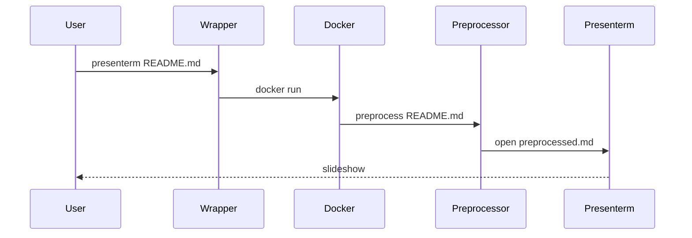

# presenterm-wrapper

Run Markdown slide decks through a reproducible Docker runtime with an opinionated preprocessor and a [Kitty](https://sw.kovidgoyal.net/kitty/) launcher.

Wraps [presenterm](https://github.com/mfontanini/presenterm) with bundled dependencies and some adjusted default behaviour.

Bundled runtime dependencies:
- `presenterm` (slide engine)
- Mermaid CLI / `mmdc` (diagram rendering)
- `pandoc` (document conversion pipeline)
- `typst` (LaTeX/typst rendering backend)
- `chromium` + `chromium-sandbox` (headless render runtime)
- Python 3 (preprocessor entrypoint)

## Quickstart

1. 🏗️ Build the image:
   ```bash
   make build
   ```

2. ⚙️ Install the wrapper command locally to `~/.local/bin/presenterm`:
   ```bash
   make install
   ```

3. 🎬 Present a deck from your current working directory:
   ```bash
   presenterm README.md
   ```

## Usage

- The wrapper mounts your current working directory to `/data` in the container.
- The wrapper sets the container working directory to the input file's parent directory.
- The preprocessor writes a hidden transformed file in cwd:
  - `.presenterm-preprocessed-<input-name>.md`

> [!CAUTION]
> **Preprocessed File Is Regenerated**
> `.presenterm-preprocessed-<name>.md` is overwritten on each run.
> Do not edit it manually; edit the source markdown instead.

## Example

```bash
presenterm README.md
presenterm docs/roadmap.md
IMAGE_NAME=presenterm-wrapper TAG=latest presenterm docs/demo.md
```

| Command                | Purpose                           |
|------------------------|-----------------------------------|
| `make build`           | Build runtime image               |
| `make install`         | Install wrapper to `~/.local/bin` |
| `presenterm README.md` | Start deck from cwd               |

## Troubleshooting

- `mmdc` Chromium sandbox errors:
  - The image runs Chromium with container-safe Puppeteer flags.
- `Unknown output format typst`:
  - Use the included modern Pandoc in the image.
- `spawning 'typst' failed`:
  - Ensure image rebuild includes Typst install.
- Relative asset path failures:
  - Run `presenterm` from a cwd that contains the referenced files.

## Execution Sequence



## Preprocessing Manipulations

The preprocessor applies the following transformations before launching `presenterm`.

- Strip Horizontal Rules (Outside Frontmatter)
- Dedent Indented Fenced Code Blocks
- Insert Heading Font Controls
- Center Markdown Tables
- Insert Slide Separators Between Top Headings

## TODO

- [x] Wrapper installed and available on `PATH`
- [x] `mmdc`, `pandoc`, and `typst` available in container
- [x] Relative asset paths resolve from slide file directory
- [x] Kitty window and tab titles are set from deck metadata
- [ ] Add `make verify` target for container tool smoke tests
- [ ] Add CI build matrix for `linux/amd64` and `linux/arm64`
- [ ] Verify other architectures are supported
- [ ] Add configurable profile presets (demo vs presenter mode)
