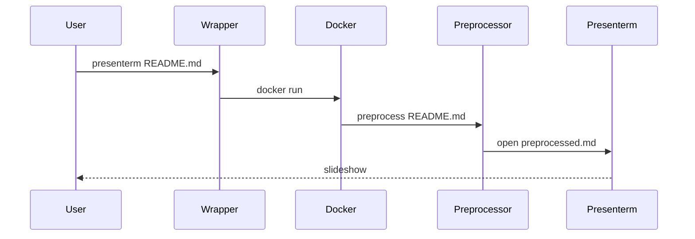

# presenterm-wrapper

Run Markdown slide decks through a reproducible Docker runtime with an opinionated preprocessor and a [Kitty](https://sw.kovidgoyal.net/kitty/) launcher.

Wraps [presenterm](https://github.com/mfontanini/presenterm) with bundled dependencies and some adjusted default behaviour.

Bundled runtime dependencies:
- `presenterm` (slide engine)
- Mermaid CLI / `mmdc` (diagram rendering)
- `pandoc` (document conversion pipeline)
- `typst` (LaTeX/typst rendering backend)
- `chromium` + `chromium-sandbox` (headless render runtime)
- Python 3 (preprocessor entrypoint)

## Quickstart

1. Build the image:
   ```bash
   make build
   ```

2. Install the wrapper command locally to `~/.local/bin/presenterm`:
   ```bash
   make install
   ```

3. Present a deck from your current working directory:
   ```bash
   presenterm README.md
   ```
4. Create a new presentation template in your current working directory:
   ```bash
   presenterm --init my-talk.md
   ```

## Font Size Configuration

Font sizes are configured declaratively via `presenterm-config.yaml` and per-deck frontmatter overrides. The system computes the optimal terminal base font and integer multipliers (1-7) from a desired point size and heading/body ratio.

### Global defaults (`presenterm-config.yaml`)

```yaml
wrapper:
  font_size: 27        # desired body text size in pt
  heading_ratio: 0.75  # heading/body ratio (e.g. 0.75 = heading is 3/4 of body)
  padding: [20, 80]    # CSS-style padding in pixels [vertical, horizontal]
  image_scale: 1.0     # image scale at reference font_size
  theme_override:      # injected into every deck's frontmatter
    footer:
      style: template
      left:
        image: mustwork-logo.png
```

### Per-deck override (frontmatter)

```yaml
---
title: My Talk
font_size: 36
heading_ratio: 0.6
---
```

Frontmatter values override config defaults. The wrapper strips `font_size` and `heading_ratio` before presenterm sees the frontmatter.

### How it works

Given `font_size` (target pt) and `heading_ratio`, the system iterates multipliers 1-7 and picks the `(base, body_mult, heading_mult)` triple that minimises the combined error against target size and ratio:

| Setting | Result |
|---------|--------|
| 27pt, 0.75 ratio | base=7, body=4 (28pt), heading=3 (21pt) |
| 36pt, 0.75 ratio | base=9, body=4 (36pt), heading=3 (27pt) |
| 36pt, 0.6 ratio | base=7, body=5 (35pt), heading=3 (21pt) |
| 18pt, 0.75 ratio | base=6, body=3 (18pt), heading=2 (12pt) |

The computed `base` becomes Kitty's terminal font size. The integer multipliers are injected as `<!-- font_size: N -->` comments in the preprocessed markdown. The intro slide title uses the heading multiplier; subtitle, date, and author use the body multiplier.

## Usage

- The wrapper mounts your current working directory to `/data` in the container.
- The wrapper sets the container working directory to the input file's parent directory.
- The preprocessor writes a hidden transformed file in cwd:
  - `.presenterm-preprocessed-<input-name>.md`

> [!CAUTION]
> **Preprocessed File Is Regenerated**
> `.presenterm-preprocessed-<name>.md` is overwritten on each run.
> Do not edit it manually; edit the source markdown instead.

## Example

```bash
presenterm README.md
presenterm docs/roadmap.md
IMAGE_NAME=presenterm-wrapper TAG=latest presenterm docs/demo.md
presenterm --init my-talk.md
```

| Command                | Purpose                           |
|------------------------|-----------------------------------|
| `make build`           | Build runtime image               |
| `make install`         | Install wrapper to `~/.local/bin` |
| `presenterm README.md` | Start deck from cwd               |
| `presenterm --init my-talk.md` | Create a starter deck in cwd |

## Preprocessing Manipulations

The preprocessor applies the following transformations before launching `presenterm`.

- Strip Horizontal Rules (Outside Frontmatter)
- Dedent Indented Fenced Code Blocks
- Insert Heading Font Controls (h1/h2 get heading size, body restored after)
- Insert Empty Line After Headings (body font height spacing)
- Center Markdown Tables
- Insert Slide Separators Between Top Headings
- Inject Theme Overrides Into Frontmatter (footer, intro slide fonts)
- Generate Clean Config (strips wrapper section, injects padding)

## Troubleshooting

- `mmdc` Chromium sandbox errors:
  - The image runs Chromium with container-safe Puppeteer flags.
- `Unknown output format typst`:
  - Use the included modern Pandoc in the image.
- `spawning 'typst' failed`:
  - Ensure image rebuild includes Typst install.
- Relative asset path failures:
  - Run `presenterm` from a cwd that contains the referenced files.

## Execution Sequence



## TODO

- [x] Wrapper installed and available on `PATH`
- [x] `mmdc`, `pandoc`, and `typst` available in container
- [x] Relative asset paths resolve from slide file directory
- [x] Kitty window and tab titles are set from deck metadata
- [x] Config-driven font sizing with ratio-based computation
- [x] CSS-style padding in pixels
- [x] Intro slide font sizing (title=h1, subtitle/date/author=body)
- [ ] Add `make verify` target for container tool smoke tests
- [ ] Add CI build matrix for `linux/amd64` and `linux/arm64`
- [ ] Verify other architectures are supported
- [ ] Add configurable profile presets (demo vs presenter mode)
